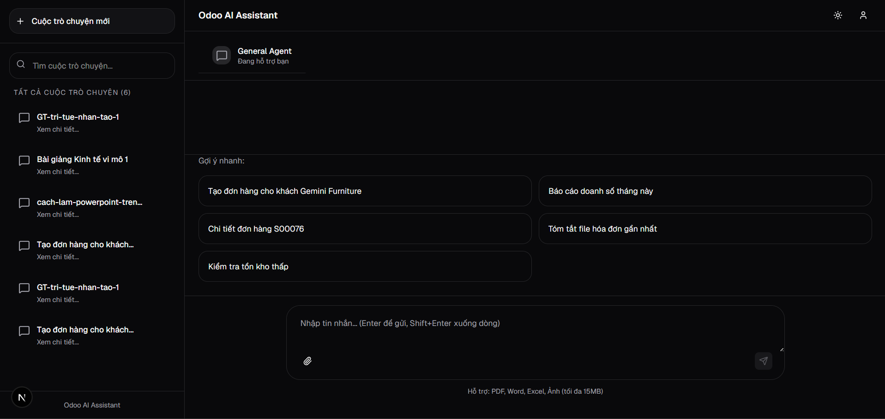
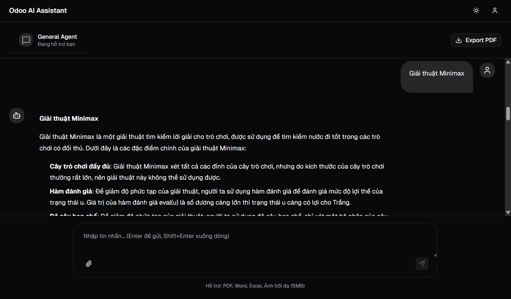
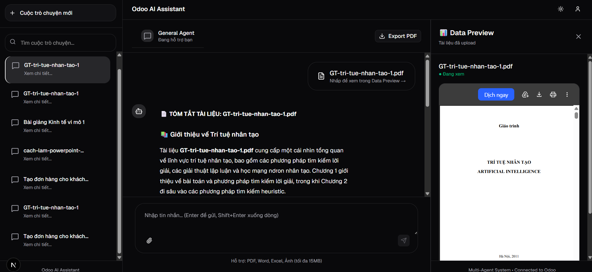

# 🚀 Odoo AI Assistant v2.0 - Multi-Agent Enterprise System

Hệ thống trợ lý ảo thông minh đa nhân tác (Multi-Agent System) thế hệ mới, hỗ trợ tự động hóa luồng quay quy trình doanh nghiệp ERP (Odoo), khai phá tri thức nâng cao (Advanced RAG), bóc tách dữ liệu thị giác (Vision OCR) và tương tác ngữ cảnh đời sống linh hoạt.

Hệ thống được phát triển dựa trên kiến trúc hướng sự kiện, xử lý bất đồng bộ toàn phần giúp đạt hiệu năng cao, tối ưu hóa chi phí token và vận hành an toàn tuyệt đối trong môi trường Enterprise.

---

## 🏗️ Kiến Trúc Hệ Thống (System Architecture)

Hệ thống được thiết kế theo mô hình **Supervisor Agent Pattern** phân cấp phối hợp, chia làm 4 tầng kiến trúc cốt lõi:

1. **Tầng Giao Diện & Điều Phối API (FastAPI Gateway):** - Tiếp nhận dữ liệu hỗn hợp (Text / Files) bất đồng bộ.
   - Cơ chế giám sát kết nối người dùng (`Monitor Disconnect Task`) giúp bẻ gãy luồng LLM và tự động giải phóng file tạm thời gian thực nếu client ngắt kết nối giữa chừng, tiết kiệm tối đa tài nguyên RAM/Ổ cứng và Token.
2. **Tầng Định Tuyến Hội Thoại Động (Dynamic Context & Query Rewriter):**
   - Tích hợp bộ tiền xử lý ngôn ngữ và chuẩn hóa chữ Tiếng Việt (`unicodedata - NFC`).
   - Khôi phục ngữ cảnh tài liệu từ PostgreSQL dựa trên lịch sử hội thoại gần nhất (`Thread History Recovery`).
   - Áp dụng bộ **Query Rewriter thông minh** dự đoán chính xác file mục tiêu (`predicted_file`), tự động hoán đổi không gian tài liệu tương tác mà không bắt người dùng cấu hình thủ công.
3. **Tầng Não Bộ Điều Phối (LangGraph State Machine):**
   - Định tuyến trạng thái hội thoại thông qua `Supervisor Agent`. 
   - Kiểm soát State biến động chặt chẽ, hỗ trợ lưu trữ phiên làm việc lâu dài (Persistent State/Memory Checkpointing) tập trung.
4. **Tầng Thực Thi Tác Vụ Hệ Thống (Agent Tools Layer):**
   - **Business Agent (Odoo):** Kết nối XML-RPC API, cơ chế bảo vệ **Human-in-the-loop** đối với các tác vụ thay đổi trạng thái (Write/Update).
   - **Document Agent (Advanced RAG):** Cơ chế truy vấn màng lọc kép: Quét Vector trên PostgreSQL (`PGVector`) + Tái xếp hạng ngữ cảnh (`Cross-Encoder Reranker`). Hỗ trợ bóc tách mục lục tổng thể cấu trúc JSON tài liệu.
   - **Vision Agent:** Trích xuất ảnh quét chất lượng cao qua Local Tesseract OCR phối hợp LLM Vision bóc tách hóa đơn thương mại.
   - **General Agent:** Công cụ tính toán Sandbox an toàn (triệt tiêu `__builtins__` ngăn chặn lỗ hổng bảo mật RCE) kết hợp Live Weather API.

---

## 🛠️ Tính Năng Nổi Bật (Key Features)

- **Resilient AI Pipeline:** Tự động kích hoạt cơ chế phòng vệ **LLM Fallbacks 5 lớp** trên Groq API giúp hệ thống vận hành liên tục 24/7 bất chấp giới hạn Rate Limit.
- **Hybrid Document Loader:** Tự động nhận diện cấu trúc file, xử lý song song (`asyncio.gather`), tự động kích hoạt bộ chuyển đổi OCR cục bộ khi phát hiện PDF dạng ảnh scan thô.
- **Defensive Programming:** Chặn đứng các chuỗi tham số ảo giác (Hallucination) từ LLM (`file`, `unknown`, `document`), bảo vệ database khỏi các truy vấn rác.
- **Output Standardization:** Đồng bộ cấu trúc phản hồi JSON đầu ra (`status`, `answer`, `source`, `timestamp`) giúp đơn giản hóa việc tích hợp UI/UX ở tầng Frontend.

---

## 📂 Sơ Đồ Thư Mục Mã Nguồn (Repository Structure)

```text
backend/
├── app/
│   ├── agents/
│   │   ├── supervisor.py          # Bộ não điều phối LangGraph
│   │   └── utils/
│   │       └── query_rewriter.py  # Bộ viết lại câu hỏi & dự đoán ngữ cảnh file
│   ├── api/
│   │   └── routers/
│   │       ├── chat.py            # Trái tim điều phối nhận dữ liệu, xử lý ngắt kết nối
│   │       ├── odoo.py            # Tuyến Router nghiệp vụ ERP
│   │       └── history.py         # Quản lý và lưu trữ lịch sử chat thông minh
│   ├── core/
│   │   ├── config.py              # Cấu hình biến môi trường toàn cục
│   │   └── security.py            # Tầng xác thực người dùng bảo mật (JWT/OAuth2)
│   ├── rag/
│   │   └── documents/
│   │       └── document_rag.py    # Engine lõi tìm kiếm Advanced RAG & Summarization
│   ├── tools/
│   │   ├── business/              # Bộ công cụ liên kết Odoo ERP
│   │   ├── documents/             # Bộ công cụ bóc tách, tóm tắt tài liệu
│   │   └── general/               # Bộ công cụ tiện ích (Calculator Sandbox, Weather, Time)
│   └── main.py                    # Cửa ngõ API Gateway khởi chạy hệ thống FastAPI
├── .env.example                   # Tệp cấu hình mẫu các API Key hệ thống
└── requirements.txt               # Danh sách thư viện phụ thuộc của dự án


## 🖼️ Giao Diện Hệ Thống (Demo Screenshots)

| 💬 Giao Diện Tương Tác (Chat UI) | ⚙️ Điều Hướng API (Swagger UI) |
| --- | --- |
|  |  |

### 🛠️ Luồng Xử Lý Dữ Liệu Thời Gian Thực (Terminal Logs)


*Hình ảnh thực tế vận hành hệ thống phối hợp Multi-Agent và bóc tách dữ liệu.*
